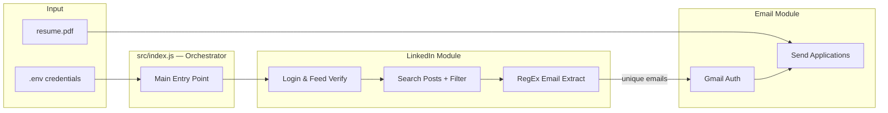

# LinkedIn Job Application Automation

> End-to-end Node.js automation that discovers targeted job opportunities on LinkedIn and sends personalized application emails — with zero manual copy-paste.

[](https://nodejs.org/)
[](https://playwright.dev/)
[](https://nodemailer.com/)
[](LICENSE)

---

## Table of Contents

- [Overview](#overview)
- [Key Features](#key-features)
- [Architecture](#architecture)
- [Tech Stack](#tech-stack)
- [Project Structure](#project-structure)
- [Quick Start](#quick-start)
- [Configuration](#configuration)
- [How It Works](#how-it-works)
- [Sample Output](#sample-output)
- [Engineering Highlights](#engineering-highlights)
- [Security & Best Practices](#security--best-practices)
- [Troubleshooting](#troubleshooting)
- [Limitations & Future Scope](#limitations--future-scope)
- [License](#license)

---

## Overview

Job hunting on LinkedIn often means scrolling through dozens of posts, manually copying recruiter emails, and sending the same application one by one. This tool automates that entire pipeline.

**What it does in one run:**

1. Logs into LinkedIn securely via browser automation
2. Searches recent **Posts** (not Jobs) for `"JAVA DEVELOPER" AND "CONTRACT"`
3. Filters results to the **Past 24 hours**
4. Extracts recruiter email addresses from post content using RegEx
5. Sends a professional application email via Gmail — with your resume attached

Built as a **modular, production-style CLI** — not a throwaway script. Each concern (config, LinkedIn, email, utilities) lives in its own module with proper error handling and logging.

---

## Key Features

| Feature | Details |
|---------|---------|
| **Secure credentials** | All secrets loaded via `dotenv` — never hardcoded |
| **Exact phrase search** | Uses quoted keywords: `"JAVA DEVELOPER" AND "CONTRACT"` |
| **Posts-only scraping** | Targets the Posts tab, not the Jobs tab |
| **Time-filtered results** | Applies "Past 24 hours" filter automatically |
| **Email extraction** | RegEx-based parsing with deduplication |
| **Bulk Gmail outreach** | Nodemailer with PDF resume attachment |
| **Rate-limit safe** | Configurable delay (default 2.5s) between sends |
| **Dev-friendly** | `HEADLESS=false` mode to watch the browser live |
| **Resilient selectors** | Multiple fallback selectors for LinkedIn UI changes |
| **Clean shutdown** | Browser always closed in `finally` block |

---

## Architecture



**Data flow:**

```
.env → config.js → index.js
                      ├── linkedin.js  →  [email1, email2, ...]
                      └── email.js     →  Gmail sent ✓
```

---

## Tech Stack

| Layer | Technology | Purpose |
|-------|------------|---------|
| Runtime | Node.js 18+ | Server-side JavaScript execution |
| Browser automation | Playwright | LinkedIn login, search, DOM scraping |
| Email delivery | Nodemailer | Gmail SMTP with attachments |
| Configuration | dotenv | Secure environment variable loading |
| Language | JavaScript (ES modules style via CommonJS) | No transpiler needed — runs directly |

---

## Project Structure

```
linkedin-job-application-automation/
│
├── .env.example              # Credential template (safe to commit)
├── .gitignore                # Excludes .env, node_modules, logs
├── package.json              # Dependencies & npm scripts
├── resume.pdf                # Applicant resume (replace with your own)
│
└── src/
    ├── index.js              # Main orchestrator — ties all modules together
    ├── config.js             # Env validation & centralized configuration
    ├── linkedin.js           # Login, search, filter, scrape logic
    ├── email.js              # Gmail transporter & application email builder
    └── utils.js              # RegEx email extractor & sleep helper
```

---

## Quick Start

### Prerequisites

- **Node.js 18+** installed
- A **LinkedIn account** (your existing account works — no new account needed)
- A **Gmail account** with [App Password](https://support.google.com/accounts/answer/185833) enabled (requires 2FA)
- Your resume as a **PDF file**

### Installation

```bash
# 1. Clone the repository
git clone <your-repo-url>
cd linkedin-job-application-automation

# 2. Install dependencies
npm install

# 3. Install Playwright Chromium browser
npx playwright install chromium

# 4. Set up environment variables
cp .env.example .env
# Open .env and fill in your credentials

# 5. Add your resume
# Place your PDF at ./resume.pdf (or update RESUME_PATH in .env)
```

### Run

```bash
# Development — browser visible (recommended for first run)
npm run dev

# Production — headless mode
HEADLESS=true npm start
```

---

## Configuration

Copy `.env.example` to `.env` and fill in the values below.

### Required

| Variable | Description |
|----------|-------------|
| `LINKEDIN_EMAIL` | Your LinkedIn login email |
| `LINKEDIN_PASSWORD` | Your LinkedIn login password |
| `GMAIL_USER` | Gmail address used to send applications |
| `GMAIL_APP_PASSWORD` | 16-character Gmail App Password ([how to create](https://support.google.com/accounts/answer/185833)) |

### Optional

| Variable | Default | Description |
|----------|---------|-------------|
| `HEADLESS` | `false` | Set `true` to hide the browser |
| `RESUME_PATH` | `./resume.pdf` | Path to your resume PDF |
| `EMAIL_DELAY_MS` | `2500` | Milliseconds between each email send |
| `APPLICANT_NAME` | `Applicant` | Name shown in email signature |
| `APPLICANT_PHONE` | — | Phone number in email body |
| `APPLICANT_LINKEDIN` | — | Your LinkedIn profile URL |

> **Never commit `.env` to Git.** Only `.env.example` with placeholders should be in the repository.

---

## How It Works

### Step 1 — LinkedIn Login

- Navigates to `https://www.linkedin.com/login`
- Fills credentials from environment variables
- Waits for feed/dashboard indicators before proceeding
- Detects security checkpoints and surfaces a clear error message

### Step 2 — Search & Extract Emails

- Builds a direct search URL with exact quoted keywords:
  ```
  "JAVA DEVELOPER" AND "CONTRACT"
  ```
- Clicks the **Posts** tab (explicitly not Jobs)
- Applies the **Past 24 hours** date filter
- Scrolls the page to lazy-load additional posts
- Extracts emails using this RegEx pattern:

```javascript
/\b[A-Za-z0-9._%+-]+@[A-Za-z0-9.-]+\.[A-Za-z]{2,}\b/g
```

- Deduplicates results into a unique array

### Step 3 — Gmail Authentication

- Creates a Nodemailer transporter with Gmail SMTP
- Verifies the connection before sending any email

### Step 4 — Send Application Emails

For each unique recruiter email:

- Composes a formal **Java Developer (Contract)** application email (plain text + HTML)
- Attaches `resume.pdf`
- Sends via Gmail
- Waits `EMAIL_DELAY_MS` before the next send to avoid rate limits

---

## Sample Output

```
============================================================
LinkedIn Job Application Automation - Starting
============================================================
[Config] Headless mode: false
[Config] Resume path: /path/to/resume.pdf

--- Step 1 & 2: LinkedIn Login and Post Search ---

[LinkedIn] Navigating to login page...
[LinkedIn] Submitting credentials...
[LinkedIn] Successfully logged into LinkedIn
[LinkedIn] Searching for posts: "JAVA DEVELOPER" AND "CONTRACT"
[LinkedIn] Selecting Posts tab...
[LinkedIn] Posts tab selected
[LinkedIn] Applying Past 24 hours filter...
[LinkedIn] Past 24 hours filter applied
[LinkedIn] Found email: recruiter@company.com
[LinkedIn] Found 1 unique recruiter email(s)

--- Step 3 & 4: Gmail Integration and Email Sending ---

[Gmail] Successfully authenticated with Gmail
[Gmail] Sending application email to recruiter@company.com (1/1)...
[Gmail] Email sent successfully to recruiter@company.com
[Gmail] Email batch complete. Sent: 1, Failed: 0

============================================================
Workflow completed successfully
Recruiter emails found: 1
Emails sent: 1
Emails failed: 0
============================================================

[Cleanup] Browser closed
```

---

## Engineering Highlights

Things an interviewer might look for — and what this project demonstrates:

| Practice | Implementation |
|----------|----------------|
| **Separation of concerns** | `config`, `linkedin`, `email`, `utils` — each module has a single responsibility |
| **Fail-fast validation** | `config.js` checks required env vars and resume file before launching the browser |
| **Defensive automation** | Multiple CSS selector fallbacks for LinkedIn's frequently changing UI |
| **Graceful error handling** | Every major block wrapped in `try/catch` with descriptive log messages |
| **Resource cleanup** | Browser closed in `finally` block — no zombie processes |
| **Idempotent email sends** | Unique email deduplication before sending |
| **Configurable behavior** | Headless mode, delays, resume path — all driven by `.env` |
| **No secrets in code** | Credentials exclusively via environment variables |

---

## Security & Best Practices

- **`.env` is gitignored** — credentials never enter version control
- **Gmail App Password** is used instead of the primary account password
- **Rate limiting** — 2.5 second delay between emails prevents Gmail blocks
- **Manual CAPTCHA fallback** — if LinkedIn shows a security checkpoint, complete it in the visible browser and re-run
- **Compliance notice** — automated scraping may conflict with LinkedIn's Terms of Service; use responsibly and for educational/personal purposes

---

## Troubleshooting

| Problem | Solution |
|---------|----------|
| `Missing required environment variables` | Copy `.env.example` → `.env` and fill all required fields |
| `Resume file not found` | Add `resume.pdf` to project root or set `RESUME_PATH` |
| Gmail authentication failed | Use a Gmail **App Password**, not your regular password |
| LinkedIn security checkpoint | Run with `HEADLESS=false`, complete verification manually, re-run |
| No emails found in posts | Posts may not contain public emails — try scrolling more or adjusting keywords |
| Playwright browser not found | Run `npx playwright install chromium` |
| LinkedIn selectors broken | LinkedIn UI may have changed — update selectors in `src/linkedin.js` |

---


---

## License

MIT — free to use, modify, and distribute.

---

<p align="center">
  Built with Node.js · Playwright · Nodemailer · dotenv
</p>
